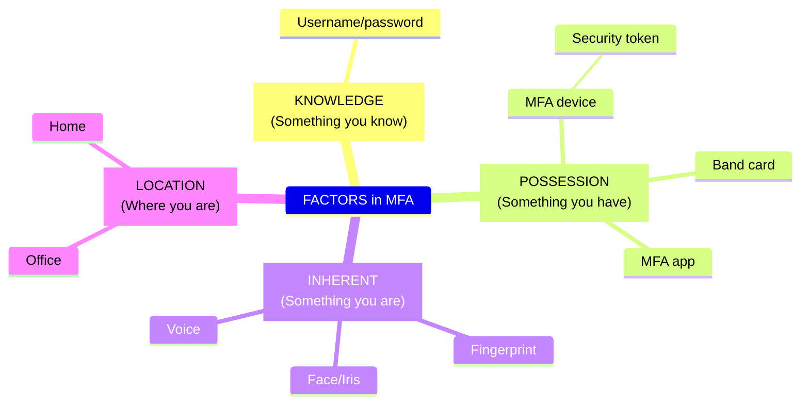
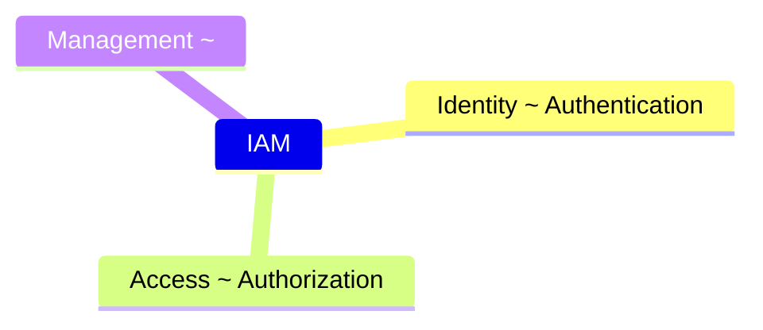
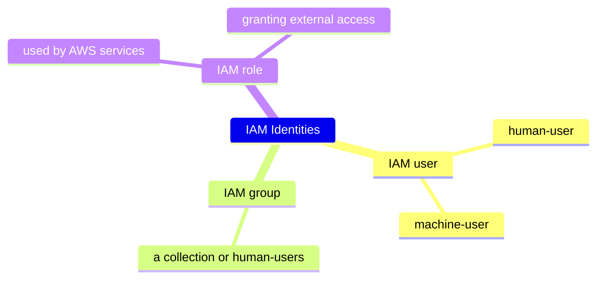

# COURSE ENVIRONMENT (CREATING AWS ACCOUNTS)

## AWS Accounts - The Basics

## [_DEMO_] ACCOUNTS - STEP1 - Creating GENERAL AWS Account

AWS account
: a container for identities & resources

root account
: aka _management account_

root user
: the user with _full_ control over the AWS account
: aka _account owner_[^15]

IAM user
: a user with _limited_[^6] control over the AWS account

---

- Update the alternative contacts[^1].
- Activate IAM Access setting for IAM users and roles to access the Billing and Cost Management console[^2].
- Bookmark the AWS Management Console for North Virginia region (`us-east-1`): <https://us-east-1.console.aws.amazon.com/console/home>

## Multi-factor Authentication (MFA)



## [_DEMO_] ACCOUNTS - STEP2 - Securing GENERAL AWS Account

- Activate MFA for your root user[^3][^4], for IAM user[^5]

## [_DEMO_] ACCOUNTS - STEP3 - Creating a Budget

- [AWS Free Tier]

  - 12 Months Free
    - EC2: 750 hours/month
    - RDS: 750 hours/month
    - S3: 5 GB
  - Always Free
    - DynamoDB: 25 GB
    - Lambda: 1 Million requests/month
    - CloudFront: 1 TB data transfer out

- In [Billing and Cost Management] [^9], update `Billing Preferences`

  - Update `Invoice delivery preferences`[^7]
    - Enable `PDF invoices delivered by email`
  - Update `Alert preferences`[^8]
    - Enable AWS Free Tier usage alerts
    - Enable CloudWatch billing alerts

---

- Create a Budget[^10]
  - [Billing and Cost Management] / [Budgets] / `Create a budget`
  - Use one of the [Budget Templates]:
    - `Zero spend budget` or
    - `Monthly cost budget`

> [!WARNING]
> After creating a budget, it can take up to 24 hours to populate all of your spend data.

## [_DO_IT_YOURSELF_] Creating the Production Account

## Identity and Access Management (IAM) Basics





> [!IMPORTANT]
> To restrict access to your AWS account, use IAM.

> [!NOTE]
> IAM identities
>
> - start with no permissions on an AWS Account,
> - but can be granted permissions (almost) up to those held by the AWS account _root user_.

> [!TIP]
> The AWS account _root user_ is a special IAM identity that has complete access to all AWS services and resources in the account.

For more information, see [Identities | IAM | AWS Docs](https://docs.aws.amazon.com/IAM/latest/UserGuide/id.html)

## [_DEMO_] ACCOUNTS - STEP4 - Adding IAMADMIN to GENERAL Account

- Create an alias for the AWS account[^11]

  > [!TIP]
  > Now the IAM users of your AWS account can sign-in using the sign-in page[^12] with URL: <https://Your_Account_Alias.signin.aws.amazon.com/console/>

- Create an IAM user[^13][^14] named `iamadmin`

## [_DEMO_] ACCOUNTS - STEP4 - Adding IAMADMIN to PRODUCTION Account

## IAM Access Keys

In AWS, _access key_ is one of 2 types of **long-term credentials**.

> [!TIP]
> The other long-term credential is the _password (and username)_ of root user and IAM users.

> [!WARNING]
> Only use access keys for use cases that require long-term credentials.

See [Manage access keys for IAM users](https://docs.aws.amazon.com/IAM/latest/UserGuide/id_credentials_access-keys.html) for more information.

### Access key alternatives

| Use case                                      | Use the access key to ...                                                                                                                                                             | Alternative recommended                                                                                                                                                                                                                                             |
| --------------------------------------------- | ------------------------------------------------------------------------------------------------------------------------------------------------------------------------------------- | ------------------------------------------------------------------------------------------------------------------------------------------------------------------------------------------------------------------------------------------------------------------- |
| CLI                                           | Enable the AWS CLI to access your AWS account                                                                                                                                         | - Use [AWS CloudShell](https://aws.amazon.com/cloudshell/?nc2=h_ql_prod_dt_cs), a browser-based CLI, to run commands. [Learn more](https://docs.aws.amazon.com/cloudshell/latest/userguide/welcome.html)                                                            |
|                                               |                                                                                                                                                                                       | - Use the [AWS CLI V2](https://aws.amazon.com/cli/) and enable authentication through a user in IAM Identity Center. [Learn more](https://docs.aws.amazon.com/cli/latest/userguide/cli-configure-sso.html)                                                          |
| Local code                                    | Enable application code in a local development environment to access your AWS account                                                                                                 | Use an Integrated Development Environment (IDE) which supports the AWS Toolkit enabling authentication through IAM Identity Center. [Learn more](https://aws.amazon.com/getting-started/tools-sdks/#IDE_and_IDE_Toolkits)                                           |
| Application running on an AWS compute service | Enable application code running on an AWS compute service like Amazon EC2, Amazon ECS, or AWS Lambda to access your AWS account                                                       | Assign an IAM role to compute resources like EC2 instances or Lambda functions to automatically supply temporary credentials to enable access. [Learn more](https://docs.aws.amazon.com/console/iam/use-role-compute)                                               |
| Third-party service                           | Enable access for a third-party application or service that monitors or manages your AWS resources                                                                                    | As a best practice, use temporary security credentials (IAM roles) instead of creating long-term credentials like access keys, and don't create AWS account root user access keys. [Learn more](https://docs.aws.amazon.com/console/iam/use-role-third-party)       |
| Application running outside AWS               | Authenticate workloads running in your data center or other infrastructure outside of AWS that needs to access your AWS resources                                                     | Use IAM Roles Anywhere to generate temporary security credentials for non AWS workloads accessing AWS services. [Learn more about providing access for non AWS workloads.](https://docs.aws.amazon.com/IAM/latest/UserGuide/id_roles_common-scenarios_non-aws.html) |
| Others                                        | For use cases that are not listed here, see [use cases that require long-term credentials with IAM users in AWS](#use-cases-that-require-long-term-credentials-with-iam-users-in-aws) | Follow [Access key best practices](#access-key-best-practices)                                                                                                                                                                                                      |

Before creating access keys, review the [alternatives to long-term access keys](https://docs.aws.amazon.com/IAM/latest/UserGuide/security-creds-programmatic-access.html#security-creds-alternatives-to-long-term-access-keys).

### Use cases that require long-term credentials with IAM users in AWS

| Use cases that require long-term credentials with IAM users in AWS           | Example                                |
| ---------------------------------------------------------------------------- | -------------------------------------- |
| Workloads that cannot use IAM roles                                          | WordPress plugins                      |
| Third-party AWS clients (that don’t support access with IAM Identity Center) | AWS clients that are not hosted on AWS |
| AWS CodeCommit access                                                        |                                        |
| Amazon Keyspaces (for Apache Cassandra) access                               |                                        |

### Access key best practices

| Access key best practices                                                    | How                                                                                                                                                                                                                                                                                                                                                                                                                                                                                                                                                                                      |
| ---------------------------------------------------------------------------- | ---------------------------------------------------------------------------------------------------------------------------------------------------------------------------------------------------------------------------------------------------------------------------------------------------------------------------------------------------------------------------------------------------------------------------------------------------------------------------------------------------------------------------------------------------------------------------------------- |
| Never store your access key in plain text, in a code repository, or in code. | Use [AWS Secrets Manager](https://docs.aws.amazon.com/secretsmanager/latest/userguide/intro.html)                                                                                                                                                                                                                                                                                                                                                                                                                                                                                        |
| Disable or delete access keys when no longer needed.                         | [Finding unused access keys](https://docs.aws.amazon.com/IAM/latest/UserGuide/id_credentials_finding-unused.html#finding-unused-access-keys) or [generate credential report](https://docs.aws.amazon.com/IAM/latest/UserGuide/id_credentials_getting-report.html), then follow [Managing access keys](https://docs.aws.amazon.com/IAM/latest/UserGuide/id_credentials_access-keys.html#Using_CreateAccessKey)                                                                                                                                                                            |
| Enable least-privilege permissions.                                          | See [Apply least-privilege permissions](https://docs.aws.amazon.com/IAM/latest/UserGuide/best-practices.html#grant-least-privilege), [Prepare for least-privilege permissions](https://docs.aws.amazon.com/IAM/latest/UserGuide/getting-started-reduce-permissions.html), [Grant least privilege](https://docs.aws.amazon.com/IAM/latest/UserGuide/access_policies.html#grant-least-priv), [Use IAM Access Analyzer to generate least-privilege policies based on access activity](https://docs.aws.amazon.com/IAM/latest/UserGuide/best-practices.html#bp-gen-least-privilege-policies) |
| Rotate access keys regularly.                                                | See [Update access keys for an IAM user without interrupting your applications](https://docs.aws.amazon.com/IAM/latest/UserGuide/Using_RotateAccessKey.html)                                                                                                                                                                                                                                                                                                                                                                                                                             |

See [best practices for managing AWS access keys](https://docs.aws.amazon.com/console/general/access-keys-best-practices)

## [_DEMO_] Creating Access keys and setting up AWS CLI v2 tools

- Follow [create your own access keys (console)](https://docs.aws.amazon.com/IAM/latest/UserGuide/id_credentials_access-keys.html#Using_CreateAccessKey) to create an access key for IAM user `iamadmin`.

  > [!WARNING]
  > This is the first use case of access key that has an [alternative recommended](#access-key-alternatives).
  >
  > For production, don't use the access key, instead authentication through a user in IAM Identity Center.

- Follow [Install or update to the latest version of the AWS CLI](https://docs.aws.amazon.com/cli/latest/userguide/getting-started-install.html) to install AWS CLI v2 tool for your platform.

  > [!TIP]
  > Use can use [mise](https://mise.jdx.dev/) to manage AWS CLI automatically.

- Configure AWS CLI for a _named profile_ (`iamadmin`)

  ```bash
  aws configure --profile iamadmin
  ```

  > [!NOTE] Where are configuration settings stored?
  > The AWS CLI stores
  >
  > - The _sensitive_ **credential** information (that you specify with `aws configure`) in a local file named `credentials`, in a folder named `.aws` in your home directory.
  > - The _non-sensitive_ **configuration** options (that you specify with `aws configure`) are stored in a local file named `config`, also stored in the `.aws` folder in your home directory.
  >
  > e.g. For Linux: they're `~/.aws/config` and `~/.aws/credentials`

  > [!TIP] Where should credentials be stored?
  > The sensitive credential can also be stored in `~/.aws/config`.
  >
  > But the recommended is storing them in `~/.aws/credentials`, which
  >
  > - take precedence over `~/.aws/config`
  > - also used by various language SDKs

  See [Configuration and credential file settings](https://docs.aws.amazon.com/cli/latest/userguide/cli-configure-files.html) for more information

---

[^1]: <https://docs.aws.amazon.com/accounts/latest/reference/manage-acct-update-contact-alternate.html>
[^2]: <https://docs.aws.amazon.com/awsaccountbilling/latest/aboutv2/control-access-billing.html#ControllingAccessWebsite-Activate>
[^3]: <https://docs.aws.amazon.com/accounts/latest/reference/getting-started-step3.html>
[^4]: <https://docs.aws.amazon.com/IAM/latest/UserGuide/enable-virt-mfa-for-root.html>
[^5]: <https://docs.aws.amazon.com/IAM/latest/UserGuide/id_credentials_mfa_enable_virtual.html#enable-virt-mfa-for-root>
[^6]: An IAM user can have full control over the AWS account.
[^7]: <https://docs.aws.amazon.com/awsaccountbilling/latest/aboutv2/billing-pref.html?icmpid=docs_billing_hp-billing-preferences#invoice-delivery-preferences>
[^8]: <https://docs.aws.amazon.com/awsaccountbilling/latest/aboutv2/billing-pref.html?icmpid=docs_billing_hp-billing-preferences#alert-preferences>
[^9]: <https://docs.aws.amazon.com/awsaccountbilling/latest/aboutv2/billing-what-is.html>
[^10]: <https://docs.aws.amazon.com/cost-management/latest/userguide/budgets-create.html>

[Billing and Cost Management]: https://console.aws.amazon.com/costmanagement/home#/
[AWS Free Tier]: https://aws.amazon.com/free/
[Budgets]: https://us-east-1.console.aws.amazon.com/billing/home?region=us-east-1#/budgets
[Budget Templates]: https://docs.aws.amazon.com/cost-management/latest/userguide/budget-templates.html

[^11]: <https://docs.aws.amazon.com/IAM/latest/UserGuide/CreateAccountAlias.html>
[^12]: <https://docs.aws.amazon.com/IAM/latest/UserGuide/id_users_sign-in.html>
[^13]: <https://docs.aws.amazon.com/IAM/latest/UserGuide/id_users_create.html>
[^14]: <https://docs.aws.amazon.com/IAM/latest/UserGuide/getting-started-emergency-iam-user.html>
[^15]: <https://docs.aws.amazon.com/IAM/latest/UserGuide/security-creds.html>
