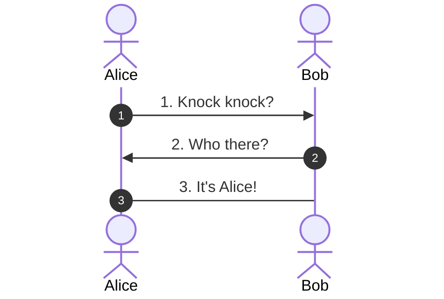
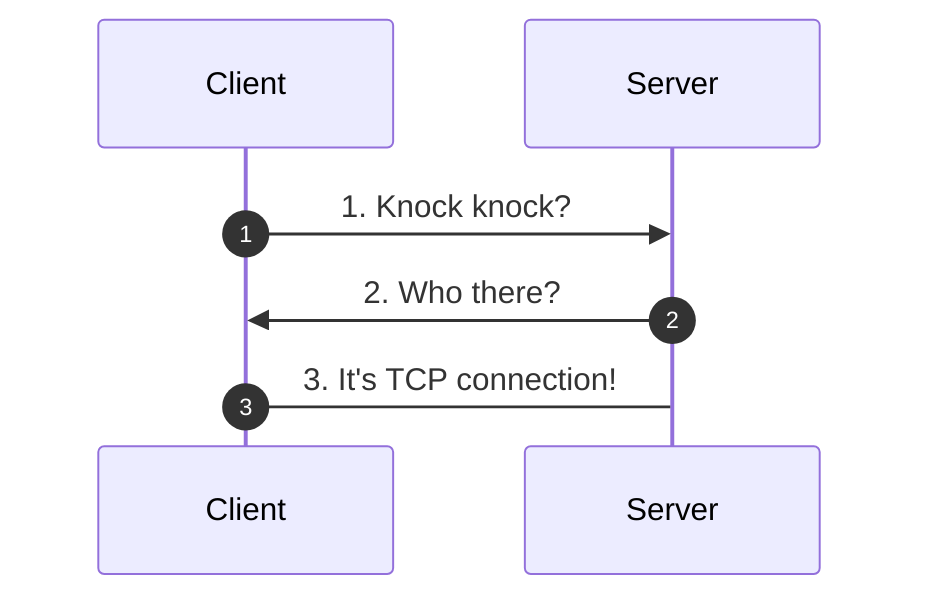
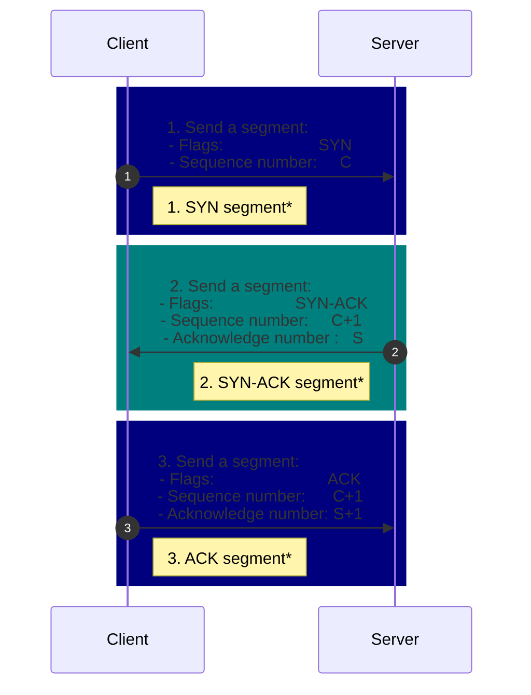
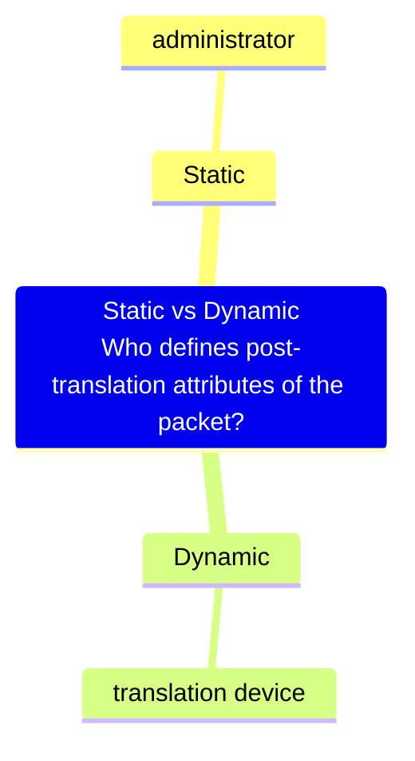
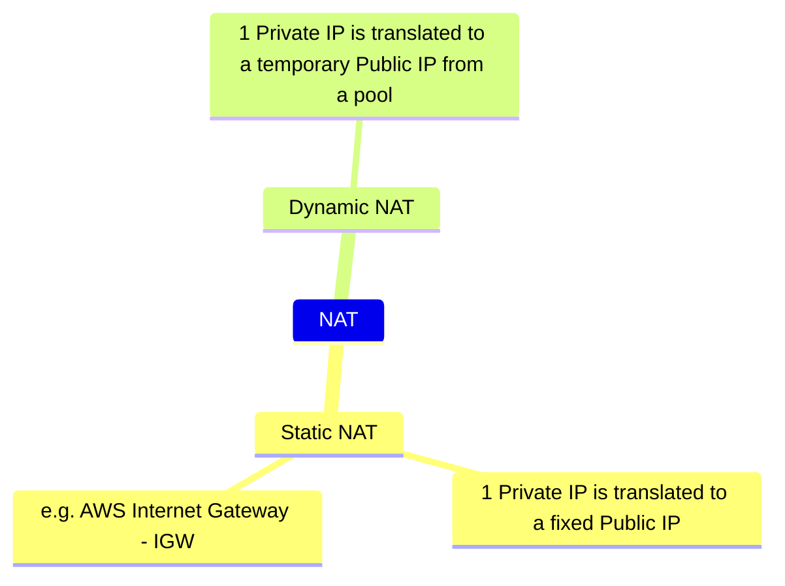
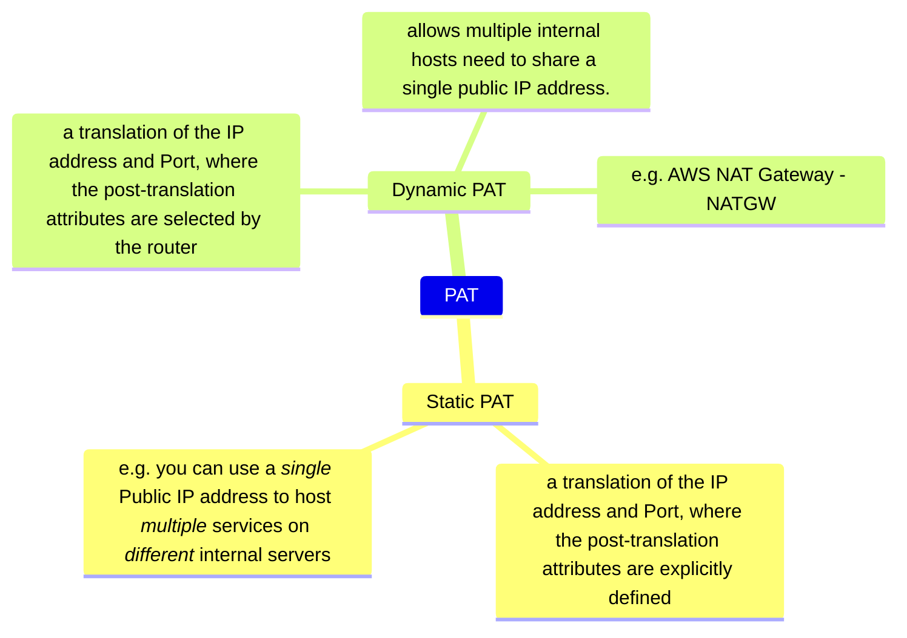

# Networking and Technical Fundamentals

This section is moved to a dedicated course - [TECH FUNDAMENTALS](https://learn.cantrill.io/p/tech-fundamentals)

## OSI 7-Layer Networking Model

### OSI Model Introduction (4:46)

|              | OSI Layer | OSI Layer Name | Mnemonic 1[^1] | Mnemonic 2 | Mnemonic 3[^1] | Mnemonic 4[^4] | Mnemonic 5[^5] | The problems[^3]  |
| ------------ | --------- | -------------- | -------------- | ---------- | -------------- | -------------- | -------------- | ----------------- |
| Host layers  | 7 ⬇️  ⬆️  | Application    | All ⬇️         | All ⬇️     | Away           | Anything       | Anyways        | Application issue |
|              | 6 ⬇️  ⬆️  | Presentation   | People         | People     | Pizza          | People         | Packets        | Service problem   |
|              | 5 ⬇️  ⬆️  | Session        | Seem           | Seem       | Sausage        | Stupid         | Stupid         | OS problem        |
|              | 4 ⬇️  ⬆️  | Transport      | To             | To         | Throw          | Tell           | Those          | Firewall issue    |
| Media layers | 3 ⬇️↕⬆️   | Network        | Need           | Need       | Not            | Not            | Need           | Routing problem   |
|              | 2 ⬇️↕⬆️   | Data link      | Data           | Delicious  | Do             | Do             | Don't          | Hardware problem  |
|              | 1 ⬇️↕⬆️   | Physical       | Processing     | Pizza      | Please ⬆️      | Please ⬆️      | People ⬆️      | Bad cable         |

> [!TIP] What is Layer 8?
> Layer 8 is a term used to refer to _user_ or _political_ layer on top of the 7-layer OSI model of computer networking - <https://en.wikipedia.org/wiki/Layer_8>

See

- <https://www.comptia.org/blog/open-systems-interconnection-reference-model>
- <http://www.tcpipguide.com/free/t_OSIReferenceModelLayerSummary.htm>

### Layer 1 - Physical (10:00)

| OSI Layer | OSI Layer Name | Protocols & Technologies | Data Type Handled | Scope                                           | Responsibilities? What it does?     | How it does?                                               | Note                                                                                  |
| --------- | -------------- | ------------------------ | ----------------- | ----------------------------------------------- | ----------------------------------- | ---------------------------------------------------------- | ------------------------------------------------------------------------------------- |
| 1         | Physical       | Cable, hub[^6]           | Bits              | **Physical signals** sent between local devices | Physical _transmission_ of data     |                                                            |                                                                                       |
|           |                |                          |                   |                                                 | - (between local devices)           | Data is re-transmit to all local devices (aka _broadcast_) | -> No device-to-device communication                                                  |
|           |                |                          |                   |                                                 | - over physical **shared** _medium_ | One transmission at a time (half-duplex)                   | Multiple devices transmit at once -> _Collisions_ (No Access control) -> Corrupt data |

### Layer 2 - DataLink - PART1 (8:47)

### Layer 2 - DataLink - PART2 (14:24)

| OSI Layer | OSI Layer Name | Protocols & Technologies | Data Type Handled | Scope                                        | Responsibilities? What it does?           | How it does?                           | Note             |
| --------- | -------------- | ------------------------ | ----------------- | -------------------------------------------- | ----------------------------------------- | -------------------------------------- | ---------------- |
| 2         | Data-link      | Ethernet, Wifi, PPP      | Frames            | **Low-level** messages between local devices | 1. [Medium access control] (MAC) layer    | Control how devices in a network gain: | Switch           |
|           |                |                          |                   |                                              |                                           | - access to a medium                   |                  |
|           |                |                          |                   |                                              |                                           | - permission to transmit data          |                  |
|           |                |                          |                   |                                              |                                           |                                        |                  |
|           |                |                          |                   |                                              | 1.5.                                      | Data Framing/Addressing                | MAC address      |
|           |                |                          |                   |                                              |                                           |                                        | ARP\*            |
|           |                |                          |                   |                                              | 2. [Logical link control] (LLC) layer[^7] | - Flow control                         | CSMA/CD, CSMA/CA |
|           |                |                          |                   |                                              |                                           | - Provides multiplexing                | PPP              |

### Layer 3 - Network - PART1 (12:06)

### Layer 3 - Network - PART2 (19:13)

### Layer 3 - Network - PART3 (15:15)

| OSI Layer | OSI Layer Name | Protocols & Technologies | Data Type Handled   | Scope                | Responsibilities? What it does? | How it does?                                 | Note                                   |
| --------- | -------------- | ------------------------ | ------------------- | -------------------- | ------------------------------- | -------------------------------------------- | -------------------------------------- |
| 3         | Network        | IP                       | Packets / Datagrams | Messages between     | Device-Level Addressing         | Each device has it own IP Address            | Src IP - Dest IP                       |
|           |                |                          |                     | - local or           |                                 |                                              | Subnet                                 |
|           |                |                          |                     | - **remote devices** | Routing                         | Each packet is routed from Src IP to Dest IP | Router, Route, Route Table, ARP\*, BGP |
|           |                |                          |                     |                      |                                 |                                              | ‑> Device‑to‑devive over internet      |
|           |                |                          |                     |                      | Data Encapsulation              |                                              |                                        |

### Layer 4&5 - Transport & Session - PART1 (15:39)

#### Transmission Control Protocol (TCP)

TCP is a connection based protocol.

- A connection is established between two devices using

  - a random, _ephemeral_ port on a client
  - a _well-known port_ on the server

- Once established, the connection is

  - bi-directional (aka _full-duplex_)
  - a _reliable_ "connection", provided via the _segments_ encapsulated in IP _packets_

#### TCP 3-way handshake

---

---

\*: These segments are sometimes refer as packets.

#### Firewall

- Stateless firewall:

  - Doesn't know

    - about the state of the connection
    - if a packet is a part of an existed connection

  - Requires 2 rules: Outbound & Inbound
  - Example: AWS Network ACL

- Stateful firewall

  - Knows

    - about the state of the connection
    - if a packet is a part of an existed connection

  - Requires only 1 rule for Outbound

### Layer 4&5 - Transport & Session - PART2 (13:54)

| OSI Layer | OSI Layer Name | Protocols & Technologies | Data Type Handled    | Scope                                    | Responsibilities? What it does?   | How it does? | Note                 |
| --------- | -------------- | ------------------------ | -------------------- | ---------------------------------------- | --------------------------------- | ------------ | -------------------- |
| 4         | Transport      | TCP/UDP                  | Segments / Datagrams | Communication between software processes | Process-Level Addressing          |              | Src Port - Dest Port |
|           |                |                          |                      |                                          | Multiplexing/De-multiplexing      |              |                      |
| 5         | Session        |                          |                      |                                          | Connections                       |              | Handshake            |
|           |                |                          |                      |                                          | Segmentation & Reassembly         |              | Segment              |
|           |                |                          |                      |                                          | Acknowledgments & Retransmissions |              | Flag, Checksum       |
|           |                |                          |                      |                                          | Flow Control                      |              |                      |
|           |                |                          |                      |                                          |                                   |              |                      |

See

- <https://www.practicalnetworking.net/stand-alone/the-truth-about-the-osi-model/>
- <https://www.practicalnetworking.net/stand-alone/tell-me-everything-that-happens-when-you-type-google-com-into-a-web-browser/>

## Other Networking (MORE COMING SOON)

### Network Address Translation (NAT) - PART1 (11:00)

### Network Address Translation (NAT) - PART2 (9:38)

NAT
: Network Address Translation
: A translation of an IP address to another IP address

---

---

---

PAT
: Port Address Translation
: A translation of an IP address and Port to another IP address and Port.

---

See

- <https://www.practicalnetworking.net/series/nat/nat-terminology/>

### IP Address Space & Subnetting - PART1 (14:37)

### IP Address Space & Subnetting - PART2 (10:32)

### Distributed Denial of Service (DDOS) Attacks (14:35)

### VLANs, TRUNKS & QinQ (16:14)

### Decimal to Binary Conversion (IP Addressing) (17:12)

### SSL & TLS (11:19)

### Border Gateway Protocol (BGP) 101 (17:03)

### Stateful vs Stateless Firewalls (14:04)

### JumboFrames (4:35)

### Layer 7 Firewalls (7:44)

### IP Sec VPN Fundamentals (14:48)

### Fibre Optic Cable 101 (11:21)

## Security (MORE COMING SOON)

### Encryption 101 - PART1 (13:56)

### Encryption 101 - PART2 (6:42)

### Envelope Encryption (8:06)

### Hardware Security Modules (HSMs) (6:40)

### Hash Functions & Hashing (13:19)

### Digital Signatures (9:26)

## DNS & DNSSEC

### DNS #1 - What does DNS do (2:56)

### DNS #2 - Why does DNS need a complex architecture (13:19)

### DNS #3 - How DNS actually works ... walking the tree (8:46)

### DNS #4 - What happens when a domain is registered? (4:27)

### DNSSEC #1 - Why do we need DNSSEC (11:08)

### DNSSEC #2 - How DNSSEC Works within a Zone (17:34)

### DNSSEC #3 - DNSSEC Chain of Trust (8:16)

### DNSSEC #4 - DNSSEC Root Signing Ceremony (7:53)

## Containers & Virtualization (MORE COMING SOON)

### Kubernetes 101 (11:27)

## Backups & DR (MORE COMING SOON)

### Recovery Point Objective (RPO) & Recovery Time Objective (RTO) (16:54)

## Data Formats & Configuration Formats (MORE COMING SOON)

### YAML aint markup language (YAML) 101 (6:12)

### Javascript Object Notation (JSON) 101 (4:25)

## Cloud Computing 101

### What is Cloud Computing? (13:30)

### Public vs Private vs Multi vs Hybrid Cloud .. (8:38)

### Cloud Service Models (IAAS, PAAS, SAAS) (10:25)

[^1]: <http://www.tcpipguide.com/free/t_OSIReferenceModelLayerMnemonics.htm>
[^3]: <https://www.reddit.com/r/ProgrammerHumor/comments/yrdvm7/comment/ivtdpim>
[^4]: <https://www.reddit.com/r/networking/comments/1n27uw/comment/ccfdrg4>
[^5]: <https://www.reddit.com/r/networking/comments/1n27uw/comment/ccer819>
[^6]: A _hub_ (aka _Ethernet hub_, _repeater hub_ or _multiport repeater_)

    - has multiple input/output (I/O) ports, in which

      - a signal introduced at the input of any port appears at the output of every port except the original incoming

[Medium access control]: https://en.wikipedia.org/wiki/Medium_access_control
[Logical link control]: https://en.wikipedia.org/wiki/Logical_link_control

[^7]: The Logical Link Control (LLC) sublayer

    - acts as an interface between the medium access control (MAC) sublayer and the network layer.
    - identify & encapsulate network layer protocols, and controls error checking and frame synchronization.
